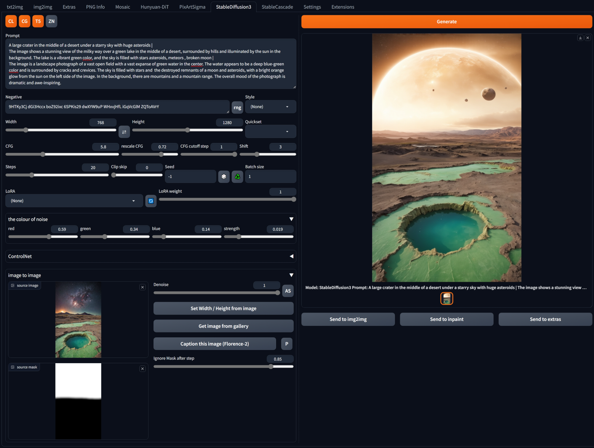

## StableDiffusion3 for Forge webui ##
I don't think there is anything Forge specific here. But A1111 has native support now.
### works for me <sup>TM</sup> on 8GB VRAM, 16GB RAM (GTX1070) ###

---
## Install ##
Go to the **Extensions** tab, then **Install from URL**, use the URL for this repository.
### SD3 (with controlNet) needs *diffusers 0.29.2* ###

Easiest way to ensure necessary diffusers release is installed is to edit **requirements_versions.txt** in the webUI directory.
```
diffusers>=0.29.2
transformers>=4.40
tokenizers>=0.19
huggingface-hub>=0.23.4
```

>[!IMPORTANT]
> **Also needs a huggingface access token:**
> Sign up / log in, go to your profile, create an access token. **Read** type is all you need, avoid the much more complicated **Fine-grained** option. Copy the token. Make a textfile called `huggingface_access_token.txt` in the main webui folder, e.g. `{forge install directory}\webui`, and paste the token in there. You will also need to accept the terms on the [SD3 repository page](https://huggingface.co/stabilityai/stable-diffusion-3-medium-diffusers).

>[!NOTE]
> Do not download the single file models, this extension cannot use them.

---
<details>
<summary>possibly necessary /alternate for Automatic1111</summary>

* open a console in the webui directory
* enter ```venv\scripts\activate```
* enter ```pip install -r requirements_versions.txt``` after making the updates listed above
</details>

---
### downloads models on first use - ~5.6GB minimum (~14.4GB including T5 text encoder) ###

---
### Branches ###
#### (noUnload branch now defunct but this information still relevant, see Change log 27/07/2024) ####
| | main | noUnload |
|---|---|---|
| info | frees models after use, reloads each time. Plays better with other apps, or if switching to other model types. | keeps models in memory (either VRAM or RAM). Avoids load times but shuffling models around memory can be slow too - especially if you don't have enough. |
| realistic minimum specs | 8GB VRAM, 16GB RAM, decent SSD | 6GB VRAM?, 16GB RAM |
| T5 performance | should be optimal for hardware used (device_map='auto', for those who know what that means) | minimises VRAM usage (for me it can be ~15% slower) (custom device_map) |

For me: GTX 1070 8GB VRAM, 16GB RAM, not top-end SSD **main** is a little faster overall. If using mechanical HD, **noUnload** should be much faster (after the initial load).

---
almost current UI screenshot



---
<details>
<summary>Change log</summary>

#### 27/07/2024 ####
* added drawing of masks for image to image. Load/copy the source image into the mask, to use as a template.
* combined branches: now noUnload is an option. Much better than maintaining two branches.
* added custom checkpoints. Not sure if custom CLIPs handled correctly yet, but will fallback to base for them anyway.

#### 24/07/2024 ####
* added SuperPrompt button (ꌗ) to rewrite simple prompts with more detail. This **overwrites** the prompt. Read about SuperPrompt [here](https://brianfitzgerald.xyz/prompt-augmentation). Credit to BrianFitzgerald for the model. (all my alternate model extensions are updated to use this; the model is loaded to a shared location so there's no wasted memory due to duplicates.)
* added loading of custom transformers. Not currently supporting custom CLIPs, and I hope no one is dumb enough to finetune the T5. They must be placed in subdirectory `models\diffusers\SD3Custom`, from the main webUI directory. Tested with a couple of finetunes from CivitAI. Not worth it, IMO.

#### 20/07/2024 ####
* corrected passing of access token - different components need it passed in different keyword arguments and will error if they receive the one they don't want (even if they get the one they do want too)... I've since noticed a deprecation warning in the console in A1111 (telling me I should use the keyword that didn't work), which is peak comedy.  Updated requirements based on installing in A1111, might be excessive but this stuff is a PITA to test.

#### 13/07/2024 ####
* reworked styles. Negatives removed; multi-select enabled; new options added, generally short and suitable for combining. Will aim to add more over time.

#### 10/07/2024 ####
* improved yesterday's effort. More compatibility, multi-line, etc.

#### 09/07/2024 ####
* some code cleanups
* added prompt parsing to automatically fill in details like seed, steps, etc.

#### 05/07/2024 ####
* guidance cutoff now works with controlNet too.
* (clip skip seems mostly useless, likely to remove in future)

#### 03/07/2024 ####
* tweaked Florence-2: model now runs on GPU so is faster.

#### 02/07/2024 ####
* fixed issue with changing batch size without changing prompt - prompt caching meant embeds would be wrong size.
* <sub>Also, wasn't passing batch size to pipeline.</sub>

#### 28/06/2024 ####
* added option for mask for image 2 image
* embiggened gallery

#### 22/06/2024 ####
* added captioning, in the image2image section. Uses [Florence-2-base](https://huggingface.co/microsoft/Florence-2-base) (faster, lighter than -large, still very good). Use the 'P' toggle button to overwrite the prompt when captions generated. Also captions are written to console. Could add a toggle to use the larger model.
* added guidance cutoff control - faster processing after cutoff at small-ish quality cost. ~~Not compatible with controlNet, so setting ignored if controlNet active.~~
* ZN toggle zeroes out the negative text embeds, different result to encoding an empty prompt. Experimental, might tend to oversaturate.
* 'rng' button generates some random alphanumerics for the negative prompt. SD3 doesn't seem to respect the negative much, so random characters can be used for tweaking outputs.

#### 21/06/2024 ####
* diffusers 0.29.1 is out, with controlNet for SD3. Models are downloaded on first use, ~1.1GB each. Note the control image must already be pre-processed, you can use controlNet in main txt2img tab for this, or external application. Currently trained best at 1024x1024, but this image size isn't enforced. Prompt should agree with controlNet: if using a sitting pose, have 'sitting' in the prompt. controlNets by [instantX](https://huggingface.co/InstantX)
* added control of 'shift', which is a scaling adjustment to sigmas used internally.
* added ability to disable any of the text encoders, different results to sending empty prompt. Note the sub-prompt interpretation remains the same as previously described (14/06).

#### 19/06/2024 B ####
* made my own pipeline (hacked together standard SD3 pipeline and image2image pipeline). Now LoRA and noise colouring work alongside image2image, though the i2i effect is the strongest. Now to put ControlNet in there too.
* added CFG rescaling.


#### 19/06/2024 ####
* fix model loading - didn't remember to pass access token to everything after moving to manual tokenize/text_encode passes. So probably every previous uploaded version was broken.
* ~~(added ControlNet support. Currently disabled, and untested, pending diffusers update. Will it work with img2img? with loras? Dunno. Will need diffusers 0.30 anyway.)~~
* ~~colouring the noise is bypassed with image2image - get corrupted results if pass latents to i2i.~~

#### 17/06/2024 ####
* minor change to add writing of noise settings to infotext

#### 16/06/2024 ####
* settings to colourize the initial noise. This offers some extra control over the output and is near-enough free. Leave strength at 0.0 to bypass it.

#### 15/06/2024 ####
* LoRA support, with weight. Put them in `models\diffusers\SD3Lora`. Only one at a time, *set_adapters* not working for SD3 pipe? Note that not all out there are the right form, so generation might cancel. Error will be logged to console. Doesn't work with i2i, that pipeline doesn't accept the parameter. Starting to think I should aim to rewrite/combine the pipelines.

#### 14/06/2024 ####
* triple prompt button removed, all handled automatically now, as follows:
	* single prompt: copied to all 3 sub-prompts - same as disabled in previous implemention
	* dual prompts: if T5 enabled, first sub-prompt copied to both CLIPs and second to T5; if T5 not enabled, sub-prompts for each CLIP
	* triple (or more) prompts: sub-prompts are copied, in order, to CLIP-L, CLIP-G, T5. Sub-prompts after the third are ignored.
* image 2 image does work for refining images


#### 13/06/2024 ####
* more refined, text encoding handled manually: all runs in 8GB VRAM (T5 on CPU)
* img2img working but not especially effective?
* seems to need flowery, somewhat overblown prompting. As such, styles probably need rewriting (at the moment, just copied from the PixArt repo).
* AS button in image to image recalculates the number of steps, so it always processes the set number. Not sure if useful.
* Clip skip slider added. Forces a recalc of the text embeds if changed.
* triple prompting added - a prompt for each text encoder. Separator is '|'. Enabled by toggling the '3' icon. Styles are applied to each subprompt. Styles could be extended to support the triple form, but maybe that's just busy work.

#### 12/06/2024 ####
* rough first implementation, based on my other extensions
* my PixArt/Hunyuan i2i method doesn't work here, but there is a diffusers pipeline for it so I should be able to hack the necessary out of that
* T5 button toggles usage of the big text encoder, off by default - ~~don't enable if you only have 8GB VRAM, it will fail~~.
* T5 with 8GB VRAM probably can work if I handle it manually (which means handling all 3 tokenizers and 3 text encoders manually).
* last used prompt embeds are cached, will be reused if the prompts don't change (toggling T5 button deletes the cache)
* no sampler selection as it seems only the default one works
* seems to go over 8GB VRAM during VAE process, but it isn't that slow so could be VAE in VRAM with transformer hanging around.
* based on the pipeline, each text encoder can have its own positive/negative prompts. Not sure if worth implementing.
</details>

---
### example ###
|battle|there's something in the woods|
|---|---|
|||

