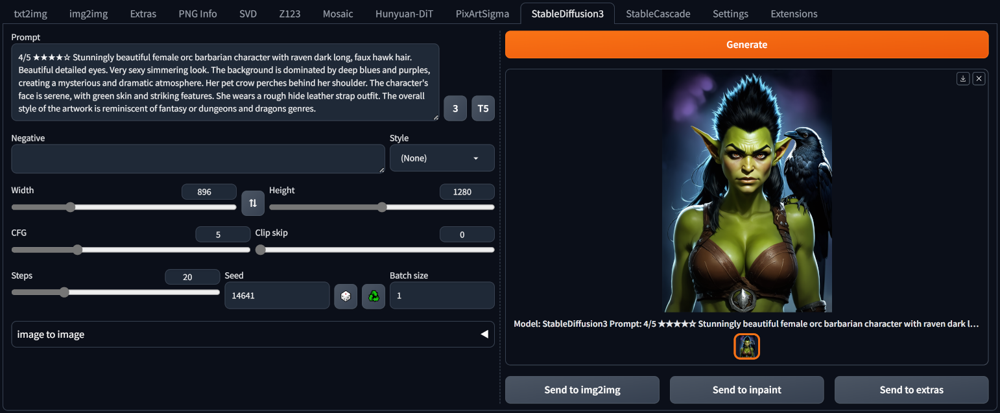

## StableDiffusion3 for webui ##
### Forge tested, probably A1111 too ###
I don't think there is anything Forge specific here.
### works for me <sup>TM</sup> on 8Gb VRAM, 16Gb RAM (GTX1070) ###

---
## Install ##
Go to the **Extensions** tab, then **Install from URL**, use the URL for this repository.
### needs *diffusers 0.29.0* ###

Easiest way to ensure necessary diffusers release is installed is to edit **requirements_versions.txt** in the webUI directory.
```
diffusers>=0.29.0
```

**Also needs a huggingface access token.** Sign up / log in, go to your profile, create an access token. Copy it. Make a textfile called ```huggingface_access_token.txt``` in the main webui folder, i.e. ```{forge install directory}\webui```, and paste the token in there.

**Do not download the single file models, this extension cannot use them.**

---
### downloads models on first use - ~5.6GB minimum (~14.4GB including T5 text encoder) ###

---
UI screenshot

prompt from [rollover @ civitAI](https://civitai.com/images/15668218)



---
#### 13/06/2024 ####
* more refined, text encoding handled manually: all runs in 8GB VRAM (T5 on CPU)
* img2img working but not especially effective?
* seems to need flowery, somewhat overblown prompting. As such, styles probably need rewriting (at the moment, just copied from the PixArt repo).
* AS button in image to image recalculates the number of steps, so it always processes the set number. Not sure if useful.
* Clip skip slider added. Forces a recalc of the text embeds if changed.
* triple prompting added - a prompt for each text encoder. Separator is '|'. Enabled by toggling the '3' icon. Styles are applied to each subprompt. Styles could be extended to support the triple form, but maybe that's just busy work.

#### 12/06/2024 ####
* rough first implementation, based on my other extensions
* my PixArt/Hunyuan i2i method doesn't work here, but there is a diffusers pipeline for it so I should be able to hack the necessary out of that
* T5 button toggles usage of the big text encoder, off by default ~~- don't enable if you only have 8GB VRAM, it will fail~~.
* T5 with 8GB VRAM probably can work if I handle it manually (which means handling all 3 tokenizers and 3 text encoders manually).
* last used prompt embeds are cached, will be reused if the prompts don't change (toggling T5 button deletes the cache)
* no sampler selection as it seems only the default one works
* seems to go over 8GB VRAM during VAE process, but it isn't that slow so could be VAE in VRAM with transformer hanging around.
* based on the pipeline, each text encoder can have its own positive/negative prompts. Not sure if worth implementing.

---


