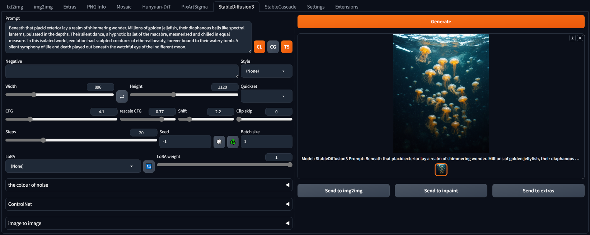

##StableDiffusion3 for webui ##
### Forge tested, probably A1111 too ###
I don't think there is anything Forge specific here.
### works for me <sup>TM</sup> on 8Gb VRAM, 16Gb RAM (GTX1070) ###

---
## Install ##
Go to the **Extensions** tab, then **Install from URL**, use the URL for this repository.
### needs *diffusers 0.29.0* ###

Easiest way to ensure necessary diffusers release is installed is to edit **requirements_versions.txt** in the webUI directory.
```
diffusers>=0.29.0
```

**Also needs a huggingface access token.** Sign up / log in, go to your profile, create an access token. Copy it. Make a textfile called ```huggingface_access_token.txt``` in the main webui folder, i.e. ```{forge install directory}\webui```, and paste the token in there.

**Do not download the single file models, this extension cannot use them.**

---
### downloads models on first use - ~5.6GB minimum (~14.4GB including T5 text encoder) ###

---
UI screenshot

prompt from [rollover @ civitAI](https://civitai.com/images/15668218)



---
#### 19/06/2024 ####
* fix model loading - didn't remember to pass access token to everything after manual tokenize/text_encode passes. So probably every previous uploaded version was broken.
* (added ControlNet support. Currently disabled, and untested, pending diffusers update. Will it work with img2img? with loras? Dunno.)
* colouring the noise is bypassed with image2image - get corrupted results if pass latents to i2i.

#### 17/06/2024 ####
* minor change to add writing of noise settings to infotext

#### 16/06/2024 ####
* settings to colourize the initial noise. This offers some extra control over the output and is near-enough free. Leave strength at 0.0 to bypass it.

#### 15/06/2024 ####
* LoRA support, with weight. Put them in ```models\diffusers\SD3Lora```. Only one at a time, *set_adapters* not working for SD3 pipe? Note that not all out there are the right form, so generation might cancel. Error will be logged to console. Doesn't work with i2i, that pipeline doesn't accept the parameter. Starting to think I should aim to rewrite/combine the pipelines.

#### 14/06/2024 ####
* triple prompt button removed, all handled automatically now, as follows:
	* single prompt: copied to all 3 sub-prompts - same as disabled in previous implemention
	* dual prompts: if T5 enabled, first sub-prompt copied to both CLIPs and second to T5; if T5 not enabled, sub-prompts for each CLIP
	* triple (or more) prompts: sub-prompts are copied, in order, to CLIP-L, CLIP-G, T5. Sub-prompts after the third are ignored.
* image 2 image does work for refining images


#### 13/06/2024 ####
* more refined, text encoding handled manually: all runs in 8GB VRAM (T5 on CPU)
* img2img working but not especially effective?
* seems to need flowery, somewhat overblown prompting. As such, styles probably need rewriting (at the moment, just copied from the PixArt repo).
* AS button in image to image recalculates the number of steps, so it always processes the set number. Not sure if useful.
* Clip skip slider added. Forces a recalc of the text embeds if changed.
* triple prompting added - a prompt for each text encoder. Separator is '|'. Enabled by toggling the '3' icon. Styles are applied to each subprompt. Styles could be extended to support the triple form, but maybe that's just busy work.

#### 12/06/2024 ####
* rough first implementation, based on my other extensions
* my PixArt/Hunyuan i2i method doesn't work here, but there is a diffusers pipeline for it so I should be able to hack the necessary out of that
* T5 button toggles usage of the big text encoder, off by default - don't enable if you only have 8GB VRAM, it will fail.
* T5 with 8GB VRAM probably can work if I handle it manually (which means handling all 3 tokenizers and 3 text encoders manually).
* last used prompt embeds are cached, will be reused if the prompts don't change (toggling T5 button deletes the cache)
* no sampler selection as it seems only the default one works
* seems to go over 8GB VRAM during VAE process, but it isn't that slow so could be VAE in VRAM with transformer hanging around.
* based on the pipeline, each text encoder can have its own positive/negative prompts. Not sure if worth implementing.

---
### example ###


